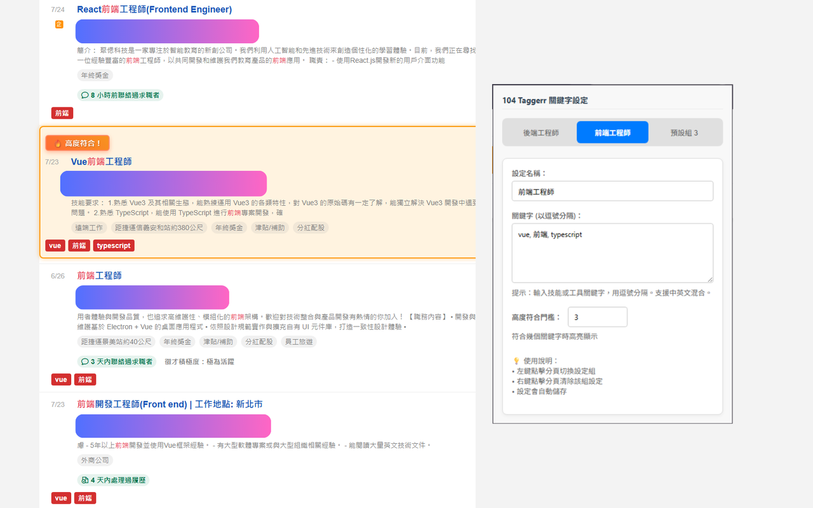

# 104 Taggerr

🎯 **104 Taggerr** 是一款 Chrome 擴充功能，可在 104 人力銀行的職缺頁面中，自動標記你設定的關鍵字並高亮顯示符合條件的職缺，協助你更快速篩選合適的工作。

## 🔧 功能特色

- 🎯 **自動關鍵字標記**：在職缺標題與描述中，自動添加紅底白字的標籤，標記出你設定的技能關鍵字
- 🔥 **高度符合提醒**：當一筆職缺符合多項關鍵字時，該項職缺會被特別高亮提醒
- 📂 **多組設定管理**：支援最多 3 組關鍵字設定，方便切換職缺類型（如前端 / 後端 / 資料分析）
- 💾 **自動儲存**：設定會自動同步至 Chrome 雲端，跨裝置同步無痛
- 🎨 **美觀介面**：使用簡潔現代的 UI 設計，操作直覺、易於上手

<div align="center">
  
  <br>
  <em>104 Taggerr 在 104 職缺頁面的運作效果</em>
</div>

## 🚀 安裝方式

### 方法一：從 Chrome 線上應用程式商店安裝（建議）

1. 前往 [104 Taggerr (Chrome 線上應用程式商店)](https://chromewebstore.google.com/detail/104-taggerr/ecbkgopdimdgjcekfcpopkbignleedno)

### 方法二：手動安裝（開發者/進階用戶）

1. Clone 或下載本專案至本機
2. 開啟 Chrome，進入 `chrome://extensions/`
3. 開啟右上角的「開發人員模式」
4. 點擊「載入已解壓縮的擴充功能」，選取專案資料夾

## ✨ 使用教學

1. 點擊 Chrome 工具列上的 `104 Taggerr` 圖示
2. 輸入你想標記的關鍵字（以逗號分隔，例如：Vue, C#, Docker）
3. 可切換不同設定組以對應不同職類
4. 設定關鍵字數量門檻（例如超過 3 個符合即高亮顯示）
5. 開啟 104 找工作頁面，即可自動看到標記與提醒

## ⚙️ 專案技術資訊

- 使用 JavaScript 編寫，無需額外框架
- 利用 Chrome Extension API 實作內容注入與儲存
- 自訂 UI 使用 HTML/CSS，介面簡潔易懂

## 📁 專案結構

```
├── manifest.json       # 擴充功能基本設定
├── popup.html          # 設定頁面 HTML
├── popup.js            # 設定頁面邏輯
├── content.js          # 核心內容腳本（注入網頁）
├── icons/              # 擴充功能圖示
├── images/             # 說明文件用圖片
└── README.md           # 說明文件
```

## 📌 版本歷史

### v1.0 

- ✅ 自動關鍵字標記
- ✅ 高度符合提醒（含動畫）
- ✅ 支援 3 組關鍵字設定
- ✅ 設定自動儲存到雲端
- ✅ 現代化介面設計
- ✅ 錯誤處理與穩定性優化

